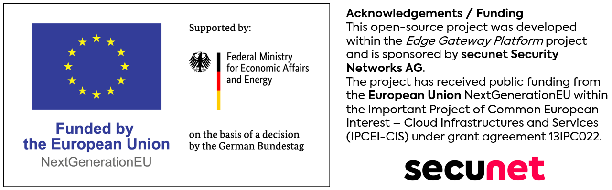

# HWaaS (Hardware-as-a-Service)

### What is the HWaaS

---

The HWaaS is a hardware-in-the-loop (HIL) testing infrastructure. It allows teams to lease hardware (Bare Metal Resources - BMRs), and interact with it remotely (boot from an image, power cycle, connect via network, read/write via serial, …), enabling software development tailored for the target hardware, and automated CI/CD tests.

### Project Goals

---

This project makes a few assumptions, that there are groups of teams that meet the following requirements:

- A desire to test on real hardware shared amongst a team
- The need to use easily sourceable components
- The requirement to run a number of custom images for BMRs, with no special configuration, bootloaders, etc., other than that the machine supports USB boot

This results in a project that lives between testing frameworks like KernelCI and LAVA, and projects for managing bare metal resources.

**There is no special requirement for what images you can run under test.**

The HWaaS uses Raspberry Pi OTG to simulate a USB drive. You can select any image you would like, and it is run as-if your machine were booting off of a USB drive. For the time being, this means that the amount of machines under test is limited by the amount of Raspberry Pis you have, but this is an easily extendable environment.

### Important Concepts

---

Here are a number of fundamental concepts to understand when working with a HWaaS system.

- **Context** - A collection of machine reservations. These are atomic hardware leases, with a maximum lifetime, that can be extended till the configured maximum. When the lifetime expires, these leases are cleaned up, and added back to the available inventory.
- **Context API** - The API responsible for the creation of contexts, networking, power management, images, and more. Most functionality will at some point touch the Context API.
- **User Tooling** - A Python/NixOS library that extends the Context API for writing tests on real hardware. These can be used for one-off development tasks, or for production CI/CD pipelines.
- **Bare Metal Resource (BMR)** - The underlying machines under test.
- **Remote Hands** - A collection of services that run on Raspberry Pis, responsible for controlling **BMR**s. These are responsible for providing images, network access, auxiliary devices, etc. to **BMRs**

### Developers

---

#### Getting Started

The HWaaS is heavily tied to NixOS. Although development is likely possible on other architectures, an x86 machine with NixOS will be the most supported development setup. You can then use `direnv` to auto-load the environment, or simply `nix develop` the load the required dependencies.

#### Project Structure

You'll find the following top level folders particularly relevant in the repository.

`components` - Where the underlying Rust infrastructure lives, i.e the Context API, Remote Hands Services, etc.

`nix` - Where all of the Nix code lives. This also contains a number of e2e and integration tests.

`vue-client` - The UI client for the HWaaS, under active development.

### Physical Components

It's worth understanding the key hardware components of a HWaaS instance, as this can help with the systems thinking required to properly debug a live setup.

**At a glance, a HWaaS instance requires the following:**

- Managed VLAN Switch - The underlying network switch used to connect all of the components, and handle outside connections. This switch also handles networking access between BMRs.
- Managed Power Switch - Used for managing machine power on the BMRs.
- PoE Switch - A PoE capable network switch for powering and providing network access to the Raspberry Pis.

The managed physical components have scripts to update the required functionality, for instance toggling machine power or controlling VLAN networks between BMRs. For the time being, these are hardware dependent and we only support a few models. In the future, we may implement a more robust adapter architecture to support more hardware.

### Pipeline

It is expected that PRs will pass the pipeline. To validate locally, you can run `nix flake check`.

**_This is quite a large build_**, even with 32GB of memory. If your machine does not have swap configured, you will likely run out of memory and your machine will stall. If this is the case you will need to run jobs separately. Looking at the CI configuration is a good entrypoint for understanding the various tests the repository contains.

## Funding

This open-source project was developed within the _Edge Gateway Platform_ project and is sponsored by **secunet Security Networks AG**.
This project has received public funding from the **European Union** NextGenerationEU within the Important Project of Common European Interest – Cloud Infrastructures and Services (IPCEI-CIS) under grant agreement 13IPC022.

  

