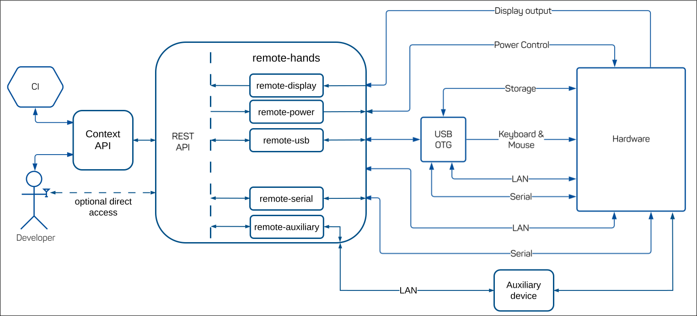
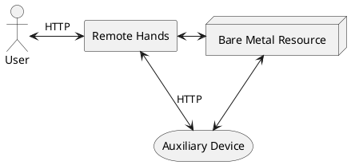
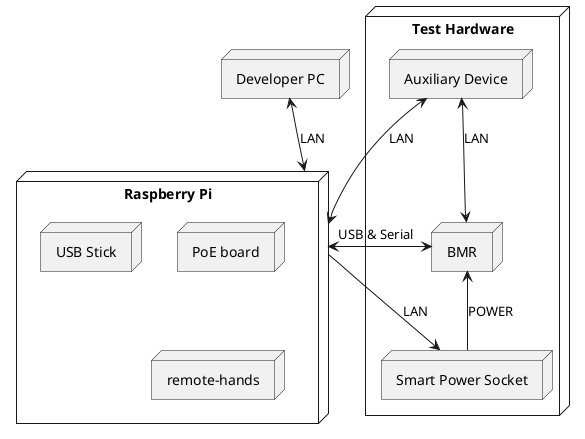

# remote-hands: Hardware-based Remote Access

`remote-hands` provides an abstraction layer in the form of multiple REST APIs
to interact with hardware.

Each API is documented according to OpenAPI V3 specification.

`remote-hands` provides some peripheral devices to the hardware via USB OTG.
USB OTG requires a USB device controller or dual role compatible hardware chip
which is available on e.g. the Raspberry Pi 4 Model B.

## Developer guide

Most tooling for this project is included in the developer shell. Use
`nix develop` to enter. The shell includes pre-commit hooks that automatically
validate the changes of a commit.

## System Architecture

The following image shows the system architecture of `remote-hands`.



!!! info

```
`remote-display` is currently not supported.
```

`remote-hands` is intended to be used via the ContextAPI,
for CI and developers alike. If the network configuration allows it, it is also
possible to interact with the remote-hands API directly, albeit without the
ContextAPI specific convenience like the image or inventory API.

## `remote-hands` services

Every `remote-hands` instance with all supported services needs to be configured
for the specific environment where it is deployed. The configuration is done via
the NixOS module mechanism. The following chapters go into detail about every
existing service, its functionality and links to the respective NixOS module
definition.

### `remote-power` service

The `remote-hands` `remote-power` service controls the power state of the attached
hardware. Any interface that can be represented in the form of
four power commands (`on`, `off`, `reset` and `query`) can be supplied. This
includes but is not limited to the following:

- IPMI
- Intel AMT
- ATX interface of the mainboard
- Smart power sockets, e.g. by Antrax
- Hardware that offers an [SNMP](https://en.wikipedia.org/wiki/Simple_Network_Management_Protocol)
  interface

How to configure a `remote-power` service of a `remote-hands` instance is
specified in the [`remote-power` NixOS module](./nix/modules/remote-power.nix) definition.

### `remote-serial` service

The `remote-hands` `remote-serial` service offers the possibility to communicate
with the hardware over at least one serial line. Currently, only `tty` character
devices, such as `/dev/ttyACM0`, as well as `stdio` are supported. A typical
solution to offer access to a hardware's legacy serial interface is via a
serial-to-USB adapter plugged directly into a USB port of the Raspberry Pi.

How to configure a `remote-serial` service of a `remote-hands` instance is
specified in the [`remote-serial` NixOS module](./nix/modules/remote-serial.nix)
definition.

### `remote-usb` service

The `remote-hands` `remote-usb` service exposes (emulated) USB peripheral devices
to the hardware over USB "On-The-Go" (OTG) functionality, such as:

- Storage
- Virtual serial lines (not implemented yet)
- Virtual keyboard
- Virtual mouse
- Ethernet (not implemented yet)

It is by far the most complex service, with restrictions around how many functions
are configured at the same time or of the same kind. These restrictions are due
to the use of USB OTG and are partly unknown yet. Currently, we limit the virtual
keyboard and mouse to exactly one per `remote-hands` instance, since we faced
issues with the USB Gadget when trying to configure more. This topic needs more
investigation, with probably more restrictions or limitations to follow.

How to configure a `remote-usb` service of a `remote-hands` instance is
specified in the [`remote-usb` NixOS module](./nix/modules/remote-usb.nix) definition.

### `remote-auxiliary` service

Auxiliary devices are extra pieces of hardware that are connected to a
test machine on one side and a `remote-hands` instance on the other side.



The goal of auxiliary devices is to complement the hardware access that is
provided by `remote-hands` with additional features, e.g. arbitrary sensors/actors.

Auxiliary devices are developed outside the scope of `remote-hands` and
provide their own respective user documentation. Furthermore, auxiliary
devices must expose their functionality via a REST interface.
`remote-hands` offers a generic way to integrate the REST interface of any
auxiliary device into the REST interface of the `remote-hands` `remote-auxiliary`
service via reverse proxy.

All auxiliary devices provide a way to enable/disable them via a shell command
that is executed by the `remote-auxiliary` service.

How to configure a `remote-auxiliary` service of a `remote-hands` instance is
specified in the [`remote-auxiliary` NixOS module](./nix/modules/remote-auxiliary.nix)
definition.

## Deployment

This section explains how a `remote-hands` instance can be set up and deployed.

### Hardware requirements

`remote-hands` makes use of the USB OTG technology and is therefore usually
deployed on an RPI 4 Model B. This model ships with the necessary
USB OTG device controller chip.

This RPI is usually powered via its USB-C port.
Unfortunately, this is the only USB port on the RPI that supports
USB OTG.
Therefore, one of the alternative power methods for the RPI needs to be
used, e.g. GPIO or POE.

This is a full list of hardware required for a `remote-hands` setup:

- RPI 4 Model B (2GB or more)
- A PoE (Power-over-Ethernet) board for the RPI
  - The RPIs original power port is needed for USB OTG.
- USB Stick (USB 3 for better speed) or SD card for the RPI
  - Will be flashed with NixOS for RPI and act as a local hard drive.
    Generates deterministic and reproducible deployments of `remote-hands`.
- LAN cable for the RPI to the general network
- Some test hardware/BMR, which can be remote-controlled by `remote-hands`
- A power solution for the BMR, depending on the selected [power control technology](#remote-power-service)
- Male USB-C to male USB cable
  - Is needed to enable the usage of USB OTG. It is connected to the power port
    of the RPI with the USB-C side. The type of the other side of the cable depends
    on the ports existing on the BMR.
- Some form of serial connection via cable
  - Depending on the BMR a serial cable and a serial-to-USB adapter might be used
    to plug into one of the RPIs USB ports.
- Optional: USB power decoupler
  - Can be added between the USB cable and the BMR
    so that the RPi does not draw power from the BMR via the USB connection.

### Cable connections

The following diagram shows a typical setup for `remote-hands`.



## Related projects

- [PiKVM, open source python project that has some overlap with `remote-hands`](https://pikvm.org/)
